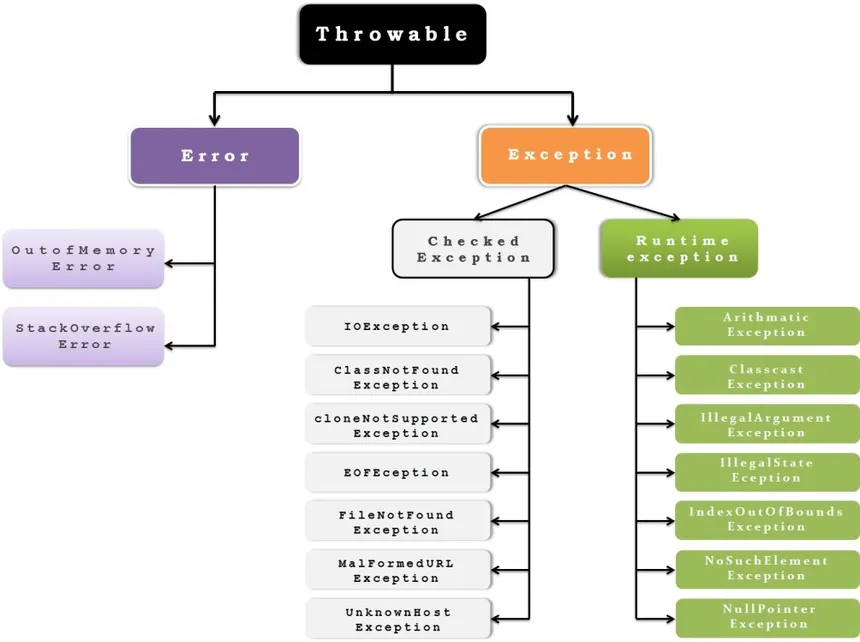

Exceptions in java
==
By definition,exception is an incidents that stops the normal running of a program asa result of errors, bugs or any 
unexpected `behaviour` of our code

- ***In Java***:

They found a way to handle exceptions sense it's a part of any program ew can encapsulate their 
behaviour, to make the code more self-expressive when it fails and can recover from it by providing 
the path of methods calls that leads to this error and the exceptions type with meaningful messages
at the info level of debugging to serve developers also to users too, at the same time it make the code more readable, 
because it  allow us to separate the regular code form the error handling code using the `try{...}catch(){...}` blocks
avoiding any brutal stop of the program execution.

- ***Throwable concept***:

Managing exception handling in java is basically based on `throwing` exceptions in the stack trace of methods like if
m1() can generate an exceptions it can basically handled by the caller of method m1() even theo that caller itself
which is method m2() can handle that exception or can throw it again to second caller m3() in the stack and eventually 
if any caller did not handle the exception with `try{...}catch(){...}` blocks will lead to a brutal stop and print 
the stack trace of methods that cause ended by this exception, and there is different types of exceptions in java.

- ***Exceptions in java***:



The diagram is showing the Exception hierarchy in java the `Throwable` class is extending directly form the `Object` class
in java we have two major subclasses extending from `Throwable` first is `Error` this basically we can say its a JVM issue
related to the JVM capacity which are `OutOfMemoryException` and `StackOverFlowException` those one the compiler will not 
tell you about them and in the code there is no way to handle them unlike the second subclass `Exception`with  two subtypes
`CheckedException` checked means the compiler will check for them before pass the code pass to execution if they're not 
handled with `try{...}catch(){...}` blocks it will show you a compile time error and usually they are related to 
environmental issues like a missing input or socket... or any unusual will be detected by the compiler, the second type
of Exceptions is the runtime errors which are not detected by the compiler (*unchecked*).

Any Exception not handled the code will not pass to execution incase of Checked the compiler will stop it before
and for the unchecked ones the compiler doesn't care if you handle them but if you did not the program will stop during 
runtime.

- ***Exception handling in java***:

in java we have `try{...}catch(){...}` block and also we can add a the `finaly{...}` block like what ever the exception
is catched or not (the try block did not throw any exception) the finaly block will always be executed usually used for 
closing object (closing a socket for example).

Example of re-throw of an exception:
```java
public class DataProcessor {
    
    // Middle layer - logs warning but doesn't handle finally
    public void processUserData(String userId) throws DataProcessingException {
        try {
            validateAndProcess(userId);
        } catch (DataProcessingException e) {
            // Log warning about the issue
            logger.warn("Data processing issue for user " + userId + ", passing to caller", e);
            // Re-throw for higher level to handle
            throw e;
        }
    }
    
    // Lower layer - the actual work
    private void validateAndProcess(String userId) throws DataProcessingException {
        if (userId == null) {
            throw new DataProcessingException("User ID cannot be null");
        }
        // Processing logic...
    }
}
// Top level - handles the final logging and user communication
public class Application {
    public void handleUserRequest(String userId) {
        DataProcessor processor = new DataProcessor();
        
        try {
            processor.processUserData(userId);
            System.out.println("Data processed successfully!");
            
        } catch (DataProcessingException e) {
            // Final handling - log error and inform user
            logger.error("Failed to process user data: " + userId, e);
            System.out.println("Sorry, we couldn't process your request. Please try again.");
        }
    }
}
```
- *one of the most practical uses of exception re-throwing*:

    - Intermediate layers: "I detect and log the problem, but you handle it"

    - Final handler: "I take ultimate responsibility for resolving this"