```mermaid
classDiagram
    class USERS {
        +int id_user
        +string username
        +string password
        +string role
        +string nom
        +string prenom
        +string email
        +string telephone
        +string adresse
        +timestamp created_at
        +timestamp updated_at
        +emprunterLivre()
        +retournerLivre()
        +consulterHistorique()
    }

    class AUTEUR {
        +int id_auteur
        +string nom
        +string prenom
        +date date_de_naissance
        +string nationalite
        +ajouterLivre()
        +modifierInfo()
    }

    class BIBLIOTHEQUE {
        +int id_bibliotheque
        +string nom
        +string adresse
        +string telephone
        +string email
        +ajouterEtage()
        +getStatistiques()
    }

    class ETAGE {
        +int id_etage
        +int id_bibliotheque
        +int numero
        +string description
        +ajouterRangee()
        +getCapacite()
    }

    class RANGEE {
        +int id_rangee
        +int id_etage
        +int numero
        +string description
        +ajouterColonne()
        +getNombreLivres()
    }

    class COLONNE {
        +int id_colonne
        +int id_rangee
        +int numero
        +ajouterEtagere()
        +verifierDisponibilite()
    }

    class ETAGERE {
        +int id_etagere
        +int id_colonne
        +int numero
        +int capacite
        +placerLivre()
        +retirerLivre()
        +getEspaceDisponible()
    }

    class LIVRE {
        +int id_livre
        +int id_etagere
        +string titre
        +int id_auteur
        +string isbn
        +int annee_publication
        +string langue
        +int nombre_pages
        +string editeur
        +ajouterExemplaire()
        +getNombreExemplaires()
        +verifierDisponibilite()
    }

    class EXEMPLAIRE {
        +int id_exemplaire
        +int id_livre
        +string code_exemplaire
        +string etat
        +date date_acquisition
        +boolean disponible
        +marquerDisponible()
        +marquerIndisponible()
        +changerEtat()
    }

    class LOCATION {
        +int id_location
        +int id_user
        +int id_exemplaire
        +date date_debut
        +date date_retour_prevue
        +date date_retour_reelle
        +float prix_location
        +string statut
        +string remarques
        +creerLocation()
        +enregistrerRetour()
        +calculerRetard()
        +calculerPenalite()
    }

    USERS "1" --> "0..*" LOCATION : effectue
    LOCATION "0..*" --> "1" EXEMPLAIRE : concerne
    EXEMPLAIRE "1..*" --> "1" LIVRE : copie de
    LIVRE "0..*" --> "1" AUTEUR : écrit par
    LIVRE "0..*" --> "0..1" ETAGERE : placé sur
    ETAGERE "1..*" --> "1" COLONNE : appartient à
    COLONNE "1..*" --> "1" RANGEE : fait partie de
    RANGEE "1..*" --> "1" ETAGE : située dans
    ETAGE "1..*" --> "1" BIBLIOTHEQUE : compose

    note for USERS "Rôles: admin, librarian, user"
    note for EXEMPLAIRE "États: Neuf, Bon, Usé, Endommagé, Perdu"
    note for LOCATION "Statuts: En cours, Retourné, En retard, Perdu"
```

```SQL
-- ====================================================
-- Système de gestion de bibliothèque avec authentification
-- ====================================================

-- Suppression des tables existantes (dans l'ordre inverse des dépendances)
DROP TABLE IF EXISTS LOCATION CASCADE;
DROP TABLE IF EXISTS EXEMPLAIRE CASCADE;
DROP TABLE IF EXISTS LIVRE CASCADE;
DROP TABLE IF EXISTS ETAGERE CASCADE;
DROP TABLE IF EXISTS COLONNE CASCADE;
DROP TABLE IF EXISTS RANGEE CASCADE;
DROP TABLE IF EXISTS ETAGE CASCADE;
DROP TABLE IF EXISTS BIBLIOTHEQUE CASCADE;
DROP TABLE IF EXISTS AUTEUR CASCADE;
DROP TABLE IF EXISTS USERS CASCADE;

-- ====================================================
-- Table USERS (fusion de CLIENT et USERS)
-- ====================================================
CREATE TABLE USERS (
    id_user SERIAL PRIMARY KEY,
    username VARCHAR(50) UNIQUE NOT NULL,
    password VARCHAR(255) NOT NULL,
    role VARCHAR(20) DEFAULT 'user' CHECK (role IN ('admin', 'user', 'librarian')),
    nom VARCHAR(100),
    prenom VARCHAR(100),
    email VARCHAR(250) UNIQUE,
    telephone VARCHAR(20),
    adresse TEXT,
    active BOOLEAN DEFAULT TRUE,
    created_at TIMESTAMP DEFAULT CURRENT_TIMESTAMP,
    updated_at TIMESTAMP DEFAULT CURRENT_TIMESTAMP
);

CREATE INDEX idx_username ON USERS(username);
CREATE INDEX idx_email ON USERS(email);

-- ====================================================
-- Table AUTEUR
-- ====================================================
CREATE TABLE AUTEUR (
    id_auteur SERIAL PRIMARY KEY,
    nom VARCHAR(100) NOT NULL,
    prenom VARCHAR(100),
    date_de_naissance DATE,
    nationalite VARCHAR(50)
);

-- ====================================================
-- Table BIBLIOTHEQUE
-- ====================================================
CREATE TABLE BIBLIOTHEQUE (
    id_bibliotheque SERIAL PRIMARY KEY,
    nom VARCHAR(100) NOT NULL,
    adresse TEXT,
    telephone VARCHAR(20),
    email VARCHAR(250)
);

-- ====================================================
-- Table ETAGE
-- ====================================================
CREATE TABLE ETAGE (
    id_etage SERIAL PRIMARY KEY,
    id_bibliotheque INTEGER NOT NULL,
    numero INTEGER NOT NULL,
    description TEXT,
    FOREIGN KEY (id_bibliotheque) REFERENCES BIBLIOTHEQUE(id_bibliotheque) ON DELETE CASCADE,
    UNIQUE (id_bibliotheque, numero)
);

-- ====================================================
-- Table RANGEE
-- ====================================================
CREATE TABLE RANGEE (
    id_rangee SERIAL PRIMARY KEY,
    id_etage INTEGER NOT NULL,
    numero INTEGER NOT NULL,
    description TEXT,
    FOREIGN KEY (id_etage) REFERENCES ETAGE(id_etage) ON DELETE CASCADE,
    UNIQUE (id_etage, numero)
);

-- ====================================================
-- Table COLONNE
-- ====================================================
CREATE TABLE COLONNE (
    id_colonne SERIAL PRIMARY KEY,
    id_rangee INTEGER NOT NULL,
    numero INTEGER NOT NULL,
    FOREIGN KEY (id_rangee) REFERENCES RANGEE(id_rangee) ON DELETE CASCADE,
    UNIQUE (id_rangee, numero)
);

-- ====================================================
-- Table ETAGERE
-- ====================================================
CREATE TABLE ETAGERE (
    id_etagere SERIAL PRIMARY KEY,
    id_colonne INTEGER NOT NULL,
    numero INTEGER NOT NULL,
    capacite INTEGER DEFAULT 50,
    FOREIGN KEY (id_colonne) REFERENCES COLONNE(id_colonne) ON DELETE CASCADE,
    UNIQUE (id_colonne, numero)
);

-- ====================================================
-- Table LIVRE
-- ====================================================
CREATE TABLE LIVRE (
    id_livre SERIAL PRIMARY KEY,
    id_etagere INTEGER,
    titre VARCHAR(255) NOT NULL,
    id_auteur INTEGER NOT NULL,
    isbn VARCHAR(20) UNIQUE,
    annee_publication INTEGER,
    langue VARCHAR(50) DEFAULT 'Français',
    nombre_pages INTEGER,
    editeur VARCHAR(100),
    FOREIGN KEY (id_etagere) REFERENCES ETAGERE(id_etagere) ON DELETE SET NULL,
    FOREIGN KEY (id_auteur) REFERENCES AUTEUR(id_auteur) ON DELETE RESTRICT
);

CREATE INDEX idx_titre ON LIVRE(titre);
CREATE INDEX idx_isbn ON LIVRE(isbn);

-- ====================================================
-- Table EXEMPLAIRE
-- ====================================================
CREATE TABLE EXEMPLAIRE (
    id_exemplaire SERIAL PRIMARY KEY,
    id_livre INTEGER NOT NULL,
    code_exemplaire VARCHAR(50) UNIQUE NOT NULL,
    etat VARCHAR(20) DEFAULT 'Bon' CHECK (etat IN ('Neuf', 'Bon', 'Usé', 'Endommagé', 'Perdu')),
    date_acquisition DATE DEFAULT CURRENT_DATE,
    disponible BOOLEAN DEFAULT TRUE,
    FOREIGN KEY (id_livre) REFERENCES LIVRE(id_livre) ON DELETE CASCADE
);

CREATE INDEX idx_code_exemplaire ON EXEMPLAIRE(code_exemplaire);
CREATE INDEX idx_disponible ON EXEMPLAIRE(disponible);

-- ====================================================
-- Table LOCATION
-- ====================================================
CREATE TABLE LOCATION (
    id_location SERIAL PRIMARY KEY,
    id_user INTEGER NOT NULL,
    id_exemplaire INTEGER NOT NULL,
    date_debut DATE NOT NULL DEFAULT CURRENT_DATE,
    date_retour_prevue DATE NOT NULL,
    date_retour_reelle DATE,
    prix_location REAL DEFAULT 0.00,
    statut VARCHAR(20) DEFAULT 'En cours' CHECK (statut IN ('En cours', 'Retourné', 'En retard', 'Perdu')),
    remarques TEXT,
    FOREIGN KEY (id_user) REFERENCES USERS(id_user) ON DELETE RESTRICT,
    FOREIGN KEY (id_exemplaire) REFERENCES EXEMPLAIRE(id_exemplaire) ON DELETE RESTRICT
);

CREATE INDEX idx_location_user ON LOCATION(id_user);
CREATE INDEX idx_location_exemplaire ON LOCATION(id_exemplaire);
CREATE INDEX idx_location_statut ON LOCATION(statut);

-- ====================================================
-- Données d'exemple
-- ====================================================

-- Utilisateurs par défaut
-- Mot de passe 'admin123' hashé avec SHA256
INSERT INTO USERS (username, password, role, nom, prenom, email, telephone, adresse) VALUES
('admin', '240be518fabd2724ddb6f04eeb1da5967448d7e831c08c8fa822809f74c720a9', 'admin', 'Admin', 'Système', 'admin@bibliotheque.com', '0600000000', '1 Rue Principale'),
('librarian', 'e3b0c44298fc1c149afbf4c8996fb92427ae41e4649b934ca495991b7852b855', 'librarian', 'Dubois', 'Marie', 'marie.dubois@bibliotheque.com', '0600000001', '2 Rue Secondaire'),
('user', '6ca13d52ca70c883e0f0bb101e425a89e8624de51db2d2392593af6a84118090', 'user', 'Martin', 'Jean', 'jean.martin@email.com', '0600000002', '3 Avenue des Livres');

-- Bibliothèque
INSERT INTO BIBLIOTHEQUE (nom, adresse, telephone, email) VALUES
('Bibliothèque Centrale', '10 Place de la République, 75001 Paris', '0142000000', 'contact@biblio-centrale.fr');

-- Structure physique
INSERT INTO ETAGE (id_bibliotheque, numero, description) VALUES
(1, 1, 'Rez-de-chaussée - Littérature générale'),
(1, 2, 'Premier étage - Sciences et Technologies');

INSERT INTO RANGEE (id_etage, numero, description) VALUES
(1, 1, 'Rangée A - Romans'),
(1, 2, 'Rangée B - Classiques'),
(2, 1, 'Rangée A - Informatique');

INSERT INTO COLONNE (id_rangee, numero) VALUES
(1, 1), (1, 2),
(2, 1),
(3, 1);

INSERT INTO ETAGERE (id_colonne, numero, capacite) VALUES
(1, 1, 50), (1, 2, 50),
(2, 1, 50),
(3, 1, 50),
(4, 1, 50);

-- Auteurs
INSERT INTO AUTEUR (nom, prenom, date_de_naissance, nationalite) VALUES
('Tolkien', 'J.R.R.', '1892-01-03', 'Britannique'),
('Martin', 'Robert C.', '1952-12-05', 'Américain'),
('Orwell', 'George', '1903-06-25', 'Britannique'),
('Hugo', 'Victor', '1802-02-26', 'Française'),
('Camus', 'Albert', '1913-11-07', 'Française');

-- Livres
INSERT INTO LIVRE (id_etagere, titre, id_auteur, isbn, annee_publication, nombre_pages, editeur) VALUES
(1, 'Le Hobbit', 1, '978-2253049548', 1937, 336, 'Le Livre de Poche'),
(2, 'Le Seigneur des Anneaux', 1, '978-2266154345', 1954, 1216, 'Pocket'),
(4, 'Clean Code', 2, '978-0132350884', 2008, 464, 'Prentice Hall'),
(3, '1984', 3, '978-0451524935', 1949, 328, 'Signet Classic'),
(2, 'Les Misérables', 4, '978-2253096337', 1862, 1824, 'Le Livre de Poche'),
(2, 'L''Étranger', 5, '978-2070360024', 1942, 186, 'Gallimard');

-- Exemplaires
INSERT INTO EXEMPLAIRE (id_livre, code_exemplaire, etat, date_acquisition) VALUES
(1, 'HOBB-001', 'Bon', '2023-01-15'),
(1, 'HOBB-002', 'Neuf', '2024-03-20'),
(2, 'SDSA-001', 'Bon', '2023-02-10'),
(3, 'CLEA-001', 'Usé', '2022-11-05'),
(4, '1984-001', 'Bon', '2023-06-12'),
(5, 'MISE-001', 'Bon', '2023-08-30'),
(6, 'ETRA-001', 'Neuf', '2024-01-10');

-- Locations (exemples)
INSERT INTO LOCATION (id_user, id_exemplaire, date_debut, date_retour_prevue, statut, prix_location) VALUES
(3, 1, '2024-11-15', '2024-12-15', 'En cours', 2.50),
(3, 4, '2024-11-20', '2024-12-20', 'En cours', 2.00);

-- ====================================================
-- Vues utiles
-- ====================================================

-- Vue pour voir les livres disponibles avec leur localisation
CREATE VIEW v_livres_disponibles AS
SELECT 
    l.id_livre,
    l.titre,
    CONCAT(a.prenom, ' ', a.nom) AS auteur,
    l.annee_publication,
    COUNT(e.id_exemplaire) AS total_exemplaires,
    SUM(CASE WHEN e.disponible = TRUE THEN 1 ELSE 0 END) AS exemplaires_disponibles,
    b.nom AS bibliotheque,
    et.numero AS etage,
    r.numero AS rangee,
    c.numero AS colonne,
    eg.numero AS etagere
FROM LIVRE l
JOIN AUTEUR a ON l.id_auteur = a.id_auteur
JOIN EXEMPLAIRE e ON l.id_livre = e.id_livre
LEFT JOIN ETAGERE eg ON l.id_etagere = eg.id_etagere
LEFT JOIN COLONNE c ON eg.id_colonne = c.id_colonne
LEFT JOIN RANGEE r ON c.id_rangee = r.id_rangee
LEFT JOIN ETAGE et ON r.id_etage = et.id_etage
LEFT JOIN BIBLIOTHEQUE b ON et.id_bibliotheque = b.id_bibliotheque
GROUP BY l.id_livre, l.titre, a.prenom, a.nom, l.annee_publication, b.nom, et.numero, r.numero, c.numero, eg.numero
HAVING SUM(CASE WHEN e.disponible = TRUE THEN 1 ELSE 0 END) > 0;

-- Vue pour l'historique des locations
CREATE VIEW v_historique_locations AS
SELECT 
    loc.id_location,
    u.username,
    CONCAT(u.prenom, ' ', u.nom) AS nom_complet,
    l.titre AS livre,
    e.code_exemplaire,
    loc.date_debut,
    loc.date_retour_prevue,
    loc.date_retour_reelle,
    loc.statut,
    CASE 
        WHEN loc.statut = 'En cours' AND loc.date_retour_prevue < CURRENT_DATE THEN 'OUI'
        ELSE 'NON'
    END AS en_retard
FROM LOCATION loc
JOIN USERS u ON loc.id_user = u.id_user
JOIN EXEMPLAIRE e ON loc.id_exemplaire = e.id_exemplaire
JOIN LIVRE l ON e.id_livre = l.id_livre
ORDER BY loc.date_debut DESC;

-- ====================================================
-- Triggers pour mettre à jour la disponibilité
-- ====================================================

-- Fonction pour mettre à jour la disponibilité d'un exemplaire
CREATE OR REPLACE FUNCTION update_exemplaire_disponibilite()
RETURNS TRIGGER AS $$
BEGIN
    IF TG_OP = 'INSERT' THEN
        -- Lors d'une nouvelle location, marquer l'exemplaire comme indisponible
        UPDATE EXEMPLAIRE 
        SET disponible = FALSE 
        WHERE id_exemplaire = NEW.id_exemplaire;
    ELSIF TG_OP = 'UPDATE' THEN
        -- Lors du retour (date_retour_reelle renseignée), marquer comme disponible
        IF NEW.date_retour_reelle IS NOT NULL AND OLD.date_retour_reelle IS NULL THEN
            UPDATE EXEMPLAIRE 
            SET disponible = TRUE 
            WHERE id_exemplaire = NEW.id_exemplaire;
        END IF;
    END IF;
    RETURN NEW;
END;
$$ LANGUAGE plpgsql;

-- Trigger sur la table LOCATION
CREATE TRIGGER trg_location_disponibilite
AFTER INSERT OR UPDATE ON LOCATION
FOR EACH ROW
EXECUTE FUNCTION update_exemplaire_disponibilite();

-- ====================================================
-- Commentaires sur les tables
-- ====================================================
COMMENT ON TABLE USERS IS 'Utilisateurs du système avec authentification et informations client';
COMMENT ON TABLE AUTEUR IS 'Auteurs des livres';
COMMENT ON TABLE BIBLIOTHEQUE IS 'Bibliothèques du réseau';
COMMENT ON TABLE ETAGE IS 'Étages des bibliothèques';
COMMENT ON TABLE RANGEE IS 'Rangées de chaque étage';
COMMENT ON TABLE COLONNE IS 'Colonnes de chaque rangée';
COMMENT ON TABLE ETAGERE IS 'Étagères de chaque colonne';
COMMENT ON TABLE LIVRE IS 'Catalogue des livres';
COMMENT ON TABLE EXEMPLAIRE IS 'Exemplaires physiques des livres';
COMMENT ON TABLE LOCATION IS 'Historique des locations de livres';
```



```mermaid
sequenceDiagram
    participant App as Application/User
    participant DB as PostgreSQL Database
    participant Trigger as trg_location_disponibilite
    participant Func as update_exemplaire_disponibilite()
    participant ExempTable as EXEMPLAIRE Table
    participant LocTable as LOCATION Table

    Note over App,LocTable: Use Case 1: INSERT - New Rental (Location)

    App->>DB: INSERT INTO LOCATION\n(id_user, id_exemplaire, date_debut,\n date_retour_prevue)
    activate DB

    DB->>LocTable: Create new location record
    activate LocTable
    LocTable-->>DB: Record created (NEW)
    deactivate LocTable

    DB->>Trigger: AFTER INSERT trigger fires
    activate Trigger

    Trigger->>Func: Execute function\nTG_OP = 'INSERT'
    activate Func

    Note over Func: Check TG_OP = 'INSERT'

    Func->>ExempTable: UPDATE EXEMPLAIRE\nSET disponible = FALSE\nWHERE id_exemplaire = NEW.id_exemplaire
    activate ExempTable

    ExempTable-->>Func: Exemplaire marked unavailable
    deactivate ExempTable

    Func-->>Trigger: RETURN NEW
    deactivate Func

    Trigger-->>DB: Trigger completed
    deactivate Trigger

    DB-->>App: INSERT successful\nExemplaire now unavailable
    deactivate DB


    Note over App,LocTable: Use Case 2: UPDATE - Book Return (Retour)

    App->>DB: UPDATE LOCATION\nSET date_retour_reelle = CURRENT_DATE,\n statut = 'Retourné'\nWHERE id_location = X
    activate DB

    DB->>LocTable: Update location record
    activate LocTable
    LocTable-->>DB: Record updated (OLD, NEW)
    deactivate LocTable

    DB->>Trigger: AFTER UPDATE trigger fires
    activate Trigger

    Trigger->>Func: Execute function\nTG_OP = 'UPDATE'
    activate Func

    Note over Func: Check TG_OP = 'UPDATE'

    Note over Func: Condition:\nNEW.date_retour_reelle IS NOT NULL\nAND OLD.date_retour_reelle IS NULL

    alt Book returned
        Func->>ExempTable: UPDATE EXEMPLAIRE\nSET disponible = TRUE\nWHERE id_exemplaire = NEW.id_exemplaire
        activate ExempTable
        ExempTable-->>Func: Exemplaire marked available
        deactivate ExempTable
    else Not returned yet
        Note over Func: No action taken
    end

    Func-->>Trigger: RETURN NEW
    deactivate Func

    Trigger-->>DB: Trigger completed
    deactivate Trigger

    DB-->>App: UPDATE successful\nExemplaire now available
    deactivate DB
```

A demo for example
### what actually is going on to see the big picture: 

![[Pasted image 20251206182042.png]]

### How to read the script (library.py):
##### Questions to ask:

-  **where am I (which state I'm in login or registration, main app...) ?**
	let's say we are in registration page:
	
![[Pasted image 20251206184126.png]]
```python
# REGISTRATION PAGE
def register_page():
	st.title("📝 Register New Account")
	with st.form("register_form"):
		col1, col2 = st.columns(2)
		with col1:
			username = st.text_input("Username*", max_chars=50)
			password = st.text_input("Password*", type="password")
			confirm_password = st.text_input("Confirm Password*", type="password")
		with col2:
			nom = st.text_input("Nom", max_chars=100)
			prenom = st.text_input("Prénom", max_chars=100)
			email = st.text_input("Email*", max_chars=250)
			telephone = st.text_input("Téléphone", max_chars=20)
			adresse = st.text_area("			telephone = st.text_inpAdresse")
			col1, col2 = st.columns(2)
		with col1:
			submitted = st.form_submit_button("Register", use_container_width=True)
		with col2:
			cancel = st.form_submit_button("Back to Login", use_container_width=True)
			if cancel:
				st.session_state.show_register = False
				st.rerun()
			if submitted:
				if not username.strip():
					st.error("Username is required")
				elif len(username) < 3:
					st.error("Username must be at least 3 characters")
				elif not password:
					st.error("Password is required")
				elif len(password) < 6:
					st.error("Password must be at least 6 characters")
				elif password != confirm_password:
					st.error("Passwords do not match")
				elif not email.strip():
					st.error("Email is required")
				elif username_exists(username):
					st.error("Username already exists")
				else:
						if register_user(username, password, 'user', nom, prenom, email, telephone, adresse):
							st.success("✅ Registration successful! Please check your email and login.")
							time.sleep(2)
							st.session_state.show_register = False
							st.rerun()
```

Now at each front end component it should definitely call function that is responsible for linking it (the front-end component ) with the data base in this case storing the user credentials in the data base using an SQL query. so next question 

- **Which function that my front-end component is using ?**

So in our case with the registration it'll be `register_user(...)` and it's doing two job storing the user credentials and at the same time sending him a welcoming email. 

```python
# HASH PASSWORD
def hash_password(password):
	return hashlib.sha256(password.encode()).hexdigest()

# REGISTER NEW USER
def register_user(username, password, role='user', nom=None, prenom=None, email=None, telephone=None, adresse=None):
    try:
        conn = get_connection()
        cursor = conn.cursor()
        hashed_pw = hash_password(password)
        cursor.execute(
            """INSERT INTO USERS (username, password, role, nom, prenom, email, telephone, adresse) 
               VALUES (%s, %s, %s, %s, %s, %s, %s, %s)""",
            (username, hashed_pw, role, nom, prenom, email, telephone, adresse)
        )
        conn.commit()
        cursor.close()
        conn.close()
        
# Send welcome email
        if email:
            subject = "Welcome to Library Management System"
            body = f"""Hello {prenom or username},

Welcome to our Library Management System!

Your account has been successfully created:
Username: {username}
Role: {role}

You can now log in and start browsing our collection.

Best regards,
Library Team"""
            send_email(email, subject, body) # see how it works next point
        
        return True
    except psycopg2.IntegrityError:
        st.error("Username or email already exists")
        return False
    except Exception as e:
        st.error(f"Error registering user: {e}")
        return False
```

for the `send_email` sent function:

```python
# SEND EMAIL FUNCTION
def send_email(to_email, subject, body):
    """Send email notification"""
    if not EMAIL_USER or not EMAIL_PASSWORD:
        st.warning("Email configuration not set. Email not sent.")
        return False
    
    try:
        msg = MIMEMultipart()
        msg['From'] = EMAIL_FROM
        msg['To'] = to_email
        msg['Subject'] = subject
        
        msg.attach(MIMEText(body, 'plain'))
        
        server = smtplib.SMTP(EMAIL_HOST, EMAIL_PORT)
        server.starttls()
        server.login(EMAIL_USER, EMAIL_PASSWORD)
        text = msg.as_string()
        server.sendmail(EMAIL_FROM, to_email, text)
        server.quit()
        
        return True
    except Exception as e:
        st.error(f"Error sending email: {e}")
        return False
```
So how it's working 
![[Pasted image 20251206191807.png]]
- Your code connects to Gmail’s SMTP server:  
    `smtp.gmail.com:587`
- It starts encryption using `server.starttls()`
- It logs in with:  
    `server.login(EMAIL_USER, EMAIL_PASSWORD)`  
    where `EMAIL_PASSWORD` **must be the Gmail App Password**, not your real password.
    
- Gmail checks:
    - “Is this a valid app password?”
    - “Is this allowed for SMTP access?”
        
- If yes → Gmail allows the script to send mail.
    
- Your email is delivered through standard SMTP, not a GUI, not a browser, and not a Gmail API.

And the same method will be applied for the rest of the code.